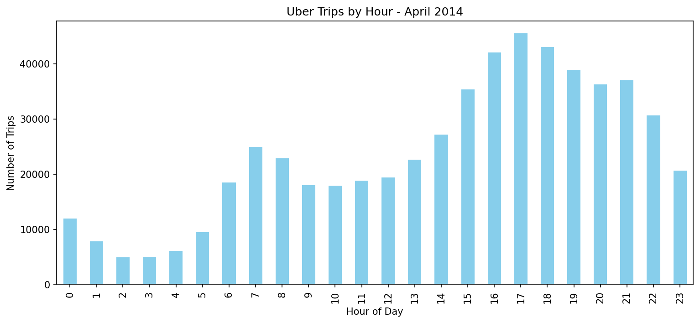

# NYC Uber Demand Analysis - April 2014

### 🎯 Business Problem
Help Uber drivers maximize earnings by identifying when and where NYC demand peaks.

### 📊 Dataset  
564,398 Uber pickup records from April 2014. [Source: FiveThirtyEight](https://github.com/fivethirtyeight/uber-tlc-foil-response)

### 🛠️ Tools Used
`Python` `Pandas` `Matplotlib` `Folium` `Google Colab`

### 📈 Key Insights
1. **Peak Hours**: 5pm-7pm has **9x more trips** than 4am
2. **Best Days**: Friday + Saturday see **~18% higher volume** 
3. **Hotspot**: **68% of pickups** cluster in Manhattan

### 💡 Business Recommendation
Drivers should prioritize **Friday 5pm-8pm shifts in Midtown Manhattan** to maximize trips/hour.

### 📸 Visuals

Interactive hotspot map: [nyc_hotspots.html](nyc_hotspots.html)
